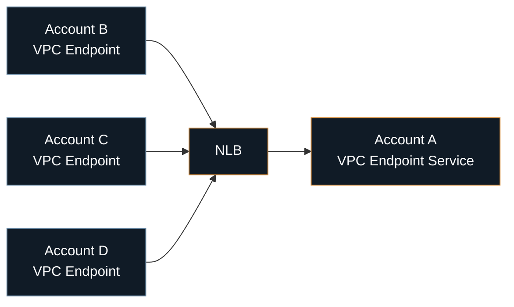
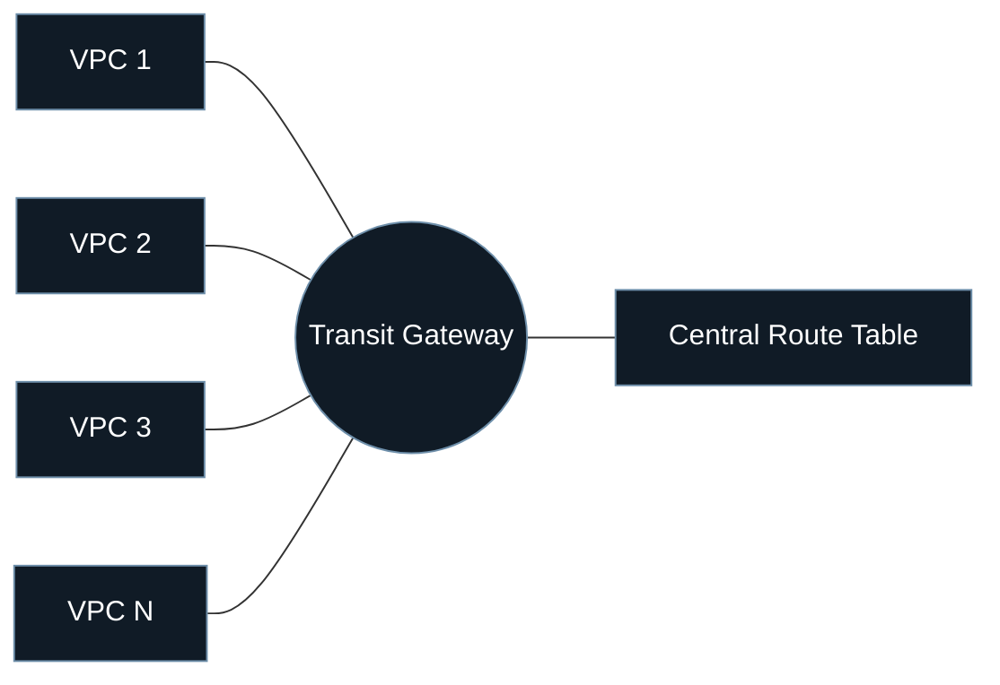
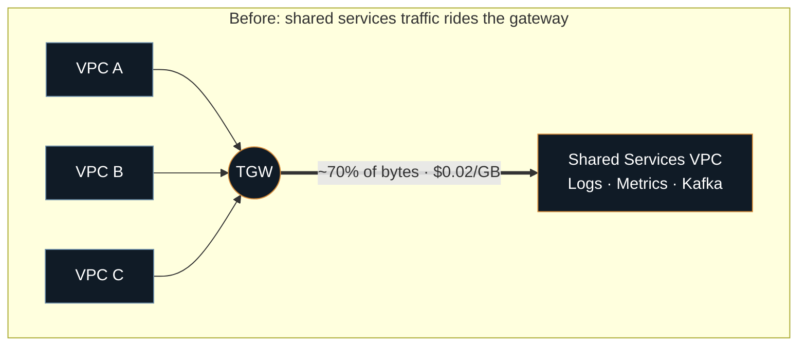
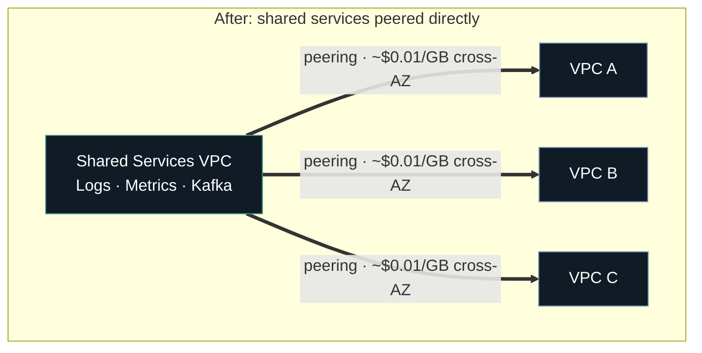
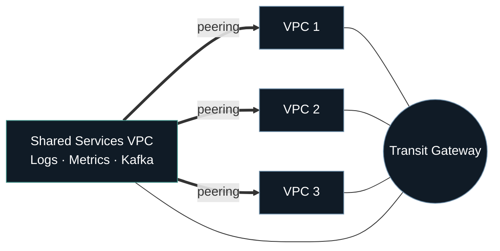

This platform's cross-account networking went through three distinct setups. Each one solved a real problem with the setup before it, and each one surfaced a new challenge that eventually needed solving too. This is that sequence, told through the challenges and the fixes.

## Stage 1: VPC Endpoints for a handful of cross-account services

The early version of the connectivity usually has the simple job: let a handful of AWS accounts reach a handful of othe AWS accounts. AWS VPCEndpoints are usually the first instinct because it is easy to setup initially. Service exposes itself with VPCEndpointService and every consumer account that needed access got a matching VPCEndpoint pointed at it.

For a small number of services, this is close to perfect. One endpoint, one service, one clean mental model.

**Challenges: VPCEndpoint sprawl**

- Every new cross-account connection means a new Endpoint Service on one side and a new Endpoint on the other.
- Add a single VPC and now you need to setup the connections again.
- Endpoints are billed per availability zone, so HA alone triples the hourly charge.
- Every GB crossing an account boundary is metered, with no volume discount.
- An Endpoint Service only speaks layer 4, so any real routing logic means bolting on an ALB per service, forever pushing the costs further.
- By the 10th service, this configuration becomes harder to track and manage

Operational complexity forces the next change: every new consumer account is another line drawn on the diagram, not a branch off something already there.

## Stage 2: Transit Gateway (Optimizing for Operational Complexity)

Transit Gateway is a regional, fully managed virtual router that scales to 5,000 attachments, and it goes straight at the sprawl problem from Stage 1. Instead of wiring an endpoint per service per consumer, every VPC attaches once, to the gateway, and routes through a single hub and a central route table: `VPC1 → TGW → VPC2`.

A new VPC now needs one attachment, not a fresh endpoint per service it wants to reach. Routing decisions live in one place instead of being scattered across every consumer account.

The sprawl problem is genuinely solved here. But almost as a side effect, TGW's flow logs finally give easy visibility the old setup never could: an actual comparison of top talkers across VPCs. That comparison turns out to matter more than the topology fix itself.

**Challenges: uniform metering hides concentration**

- TGW charges $0.02/GB processing plus an hourly fee per attachment, applied evenly to every byte on every spoke, whether that byte matters or not.
- Observability and messaging stack, logs, metrics, Kafka etc. can account for upto 70% of the traffic across accounts.
- Everything else is the organic trail of service to service traffic.
- The majority destination is quietly generating the majority of the bill, invisible in a diagram that treats every spoke the same.

## Stage 3: Transit Gateway with VPC Peering (Optimizing for Cost + Operational Complexity)

The traffic concentration from Stage 2 points at a specific fix: the logs/metrics/messaging traffic doesn't need to share a metered hop with everything else, so should gets its own path. VPC Peering is about as simple as networking gets, a direct link between two VPCs, no transitive routing, no shared middlebox, and the connection itself costs nothing. Cross-AZ traffic still carries a charge, around $0.01/GB, half of what the gateway was charging that can be solved with some smart intra-AZ design to optimize the cost

The high-traffic destinations move into a dedicated Shared Services account, and every account that talks to it gets a direct peering connection instead of a trip through the gateway. Transit Gateway doesn't disappear, it keeps handling exactly what it's good at, the long tail of smaller, less latency-sensitive traffic, where a hub still beats managing a web of direct connections one by one. The split is deliberate: peering carries whatever is driving the bill, the gateway carries everything else.

**Challenges: the design improved, onboarding didn't**

- The network is cheaper and the routing is deliberate, but adding an account still means wiring a TGW attachment and, sometimes, a peering connection by hand.
- That's still three tickets and a manual checklist per account.
- A cost fix that requires hand-wiring every new account is a cost fix that erodes the moment the team grows or turns over.

## The four models, side by side

None of these models replaced each other outright. Each ended up covering a different shape of traffic in the final setup.

| Model | Best for | Constraints | Cost shape |
|---|---|---|---|
| **VPC Endpoint** (PrivateLink) | A handful of services (2 to 10), SaaS-style one-to-many exposure | Works fine across overlapping CIDRs | Hourly per endpoint per AZ, plus per-GB |
| **VPC Peering** | High-volume, predictable, point-to-point traffic | No transitive routing, requires non-overlapping CIDRs | Free connection, roughly $0.01/GB cross-AZ |
| **Transit Gateway** | Many VPCs, complex many-to-many routing, ongoing growth | Regional, up to 5,000 attachments | Hourly per attachment, plus $0.02/GB |
| **Gateway VPC Endpoint** | S3 and DynamoDB only | Limited to those two services | Free, no hourly charge, no data fee |

If the destination happens to be S3 or DynamoDB, the Gateway Endpoint settles the question immediately: free, always available, no tradeoff to weigh.
