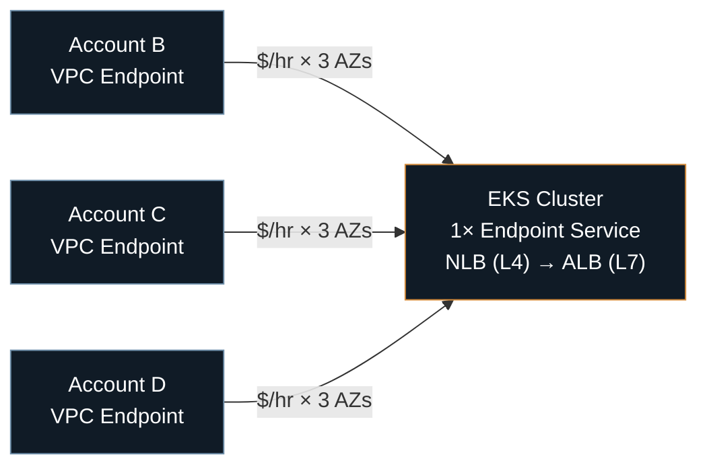
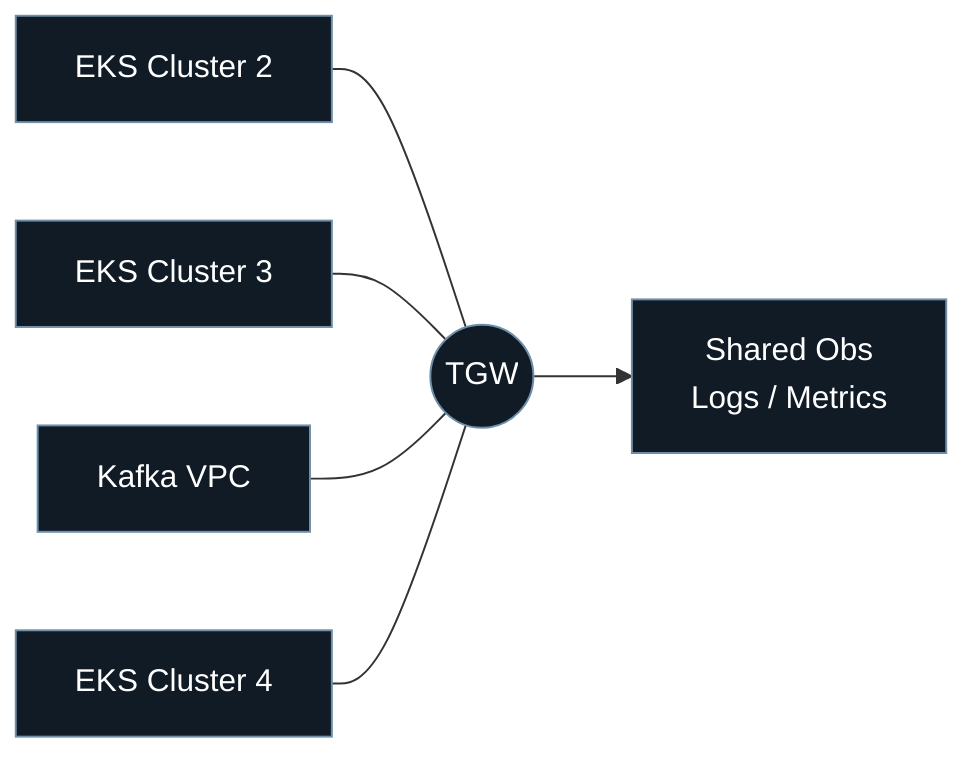
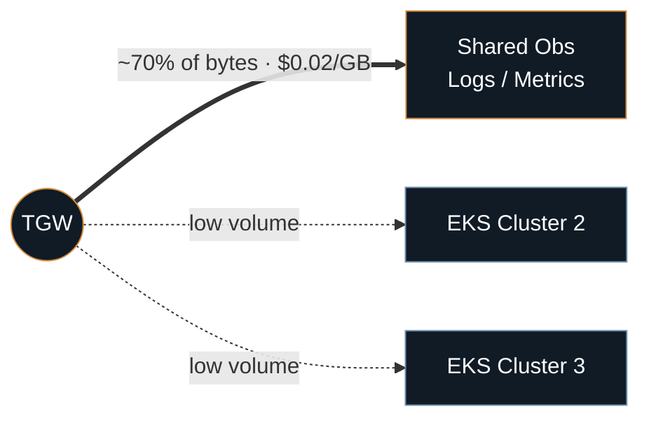
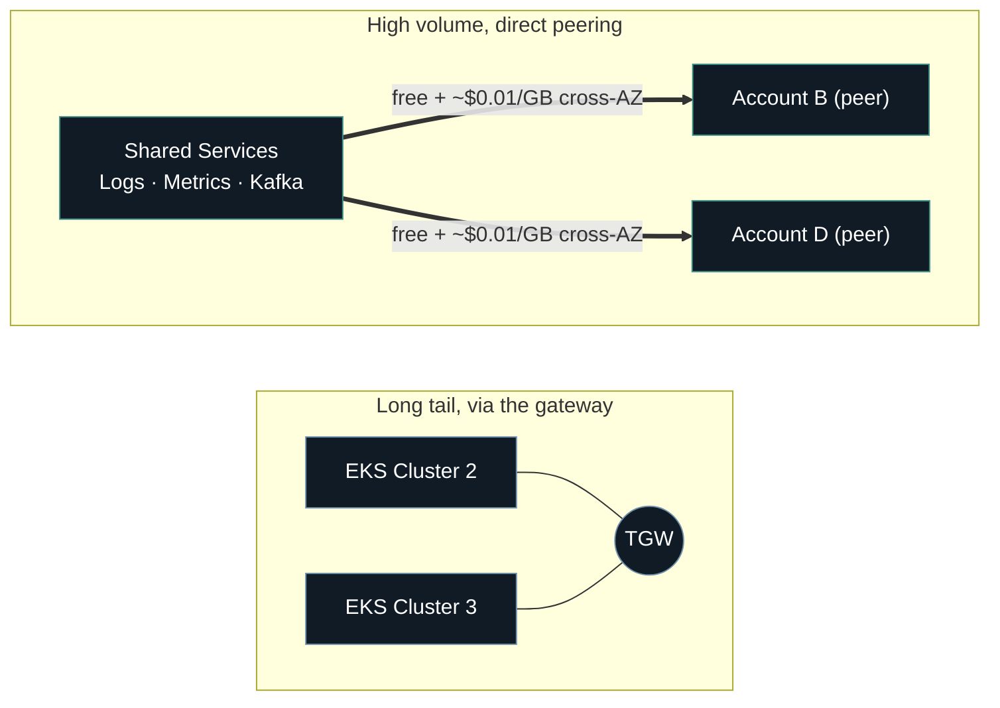

Every highly distributed platform's networking bill tells roughly the same story. It starts small and sensible. It grows without anyone deciding it should. And somewhere past a certain size, the fix isn't a new tool, it's finally looking at where the traffic goes.

This is that story, told in the order it actually happened.

## The setup that made sense on day one

The early version of this platform had a simple job: let a handful of AWS accounts reach a handful of EKS clusters. AWS PrivateLink was the obvious answer. Each cluster got a VPC Endpoint Service, fronted by an NLB (an ALB behind it when routing needed to be smarter than layer 4), and every consumer account that needed access got a matching VPC Endpoint pointed at it.

For a small number of services, this is close to perfect. One endpoint, one service, one clean mental model. Nobody has to think hard about it, and that's exactly the point of choosing it first.

It just doesn't stay small.

Every new cross-account connection means a new Endpoint Service on one side and a new Endpoint on the other. Add a single VPC and suddenly every existing service needs a fresh look. Endpoints are billed per availability zone, so the moment high availability enters the picture, that hourly charge triples on its own. Every gigabyte crossing an account boundary gets metered, with no volume discount waiting at the other end. And because an Endpoint Service only speaks layer 4, any real routing logic means bolting an ALB on top, once per service, forever.

None of this shows up on day one. It shows up on the day the twentieth cluster gets added and three engineers spend a week just tracking down which endpoint belongs to which account.

Every new consumer account becomes another line drawn on this diagram, not a branch off something already there. That's the part that eventually forces a change: not the cost, the sheer number of moving parts.

## Transit Gateway fixes the graph, not the invoice

The next step is the one most distributed platforms eventually take: Transit Gateway. It's a regional, fully managed virtual router that scales to 5,000 attachments, and the model flips completely. Instead of wiring endpoints pairwise, every VPC attaches once, to the gateway, and routes flow through a single hub: `VPC1 → TGW → VPC2`.

Against the old model, this is an immediate relief. A new VPC needs one attachment, not a fresh endpoint per service it wants to reach. Routing decisions live in one place instead of being scattered across every consumer account. And, almost as a side effect, TGW flow logs finally show something the old setup never could: an actual picture of who is talking to whom.

That last part turns out to matter more than the scaling fix itself.

The topology problem is genuinely solved here. The cost problem isn't gone, though. It's just been sitting quietly behind a $0.02 per gigabyte processing fee, plus an hourly charge per attachment, applied evenly to every byte on every spoke, whether that byte matters or not.

## The moment the traffic finally got looked at

Flow logs are the kind of thing that exist for months before anyone actually opens them. When someone finally did, the picture wasn't close to even.

Roughly 70% of all inter-account bytes were headed to one place: the shared observability and messaging stack, logs, metrics, Kafka, all the things every other service needs to talk to constantly. Everything else was a long tail of comparatively small, occasional traffic.

That single number changes the whole conversation. Under Transit Gateway, that fee of $0.02 per gigabyte applies uniformly, so the majority destination was quietly generating the majority of the bill, hidden inside a topology diagram that looked identical for high-traffic and low-traffic connections alike.

The pattern generalizes well past AWS. Traffic almost never distributes evenly across a network, and a clean architecture diagram is exactly the kind of thing that hides that fact. The fix only becomes obvious once someone measures instead of assumes.

## Splitting the network by what it actually carries

Once the concentration is visible, the fix is almost mechanical. The busiest destination doesn't need to share a metered hop with everything else, so it gets its own path.

A dedicated Shared Services account holds the high-traffic destinations, and every account that talks to it gets a direct VPC Peering connection instead of a trip through the gateway. Peering is about as simple as networking gets: a direct link between two VPCs, no transitive routing, no shared middlebox to become a bottleneck or a single point of failure, and the connection itself costs nothing. Cross-AZ traffic still carries a charge, around $0.01 per gigabyte, half of what the gateway was charging, and even that comes down further with a bit of care about which AZ each consumer actually sits in relative to the service it talks to most.

Transit Gateway doesn't disappear from the picture. It keeps handling exactly what it's good at: the long tail of smaller, less latency-sensitive traffic, where the simplicity of a hub still beats managing a web of direct connections one by one. The split is deliberate. Peering carries whatever is driving the bill. The gateway carries everything else.

## Making the fix stick

A better network design doesn't count for much if onboarding a new account is still three tickets and a manual checklist. This is the part that's easy to skip and the part that actually decides whether the fix lasts.

In the hybrid setup, adding a VPC comes down to two things: one attachment to the gateway, and, if the traffic pattern calls for it, one peering connection to Shared Services. Both get provisioned through a Terraform module that takes an account ID, a CIDR block, and a flag for whether shared-services peering applies, then handles the rest on its own. A small YAML manifest per environment holds the actual source of truth, and the module simply reconciles infrastructure against whatever the manifest says.

Onboarding a new account turns into a pull request against a text file, not a diagram edit and an afternoon of manual setup. That's the difference between a cost fix that holds for years and one that quietly unravels the next time the account count doubles.

## A rough map for choosing between the four models

None of these models replace each other. Each one is built for a different shape of traffic, and the decision usually comes down to volume, predictability, and how many endpoints are actually involved.

| Model | Best for | Constraints | Cost shape |
|---|---|---|---|
| **VPC Endpoint** (PrivateLink) | A handful of services (2 to 10), SaaS-style one-to-many exposure | Works fine across overlapping CIDRs | Hourly per endpoint per AZ, plus per-GB |
| **VPC Peering** | High-volume, predictable, point-to-point traffic | No transitive routing, requires non-overlapping CIDRs | Free connection, roughly $0.01/GB cross-AZ |
| **Transit Gateway** | 5+ VPCs, complex many-to-many routing, ongoing growth | Regional, up to 5,000 attachments | Hourly per attachment, plus $0.02/GB |
| **Gateway VPC Endpoint** | S3 and DynamoDB only | Limited to those two services | Free, no hourly charge, no data fee |

If the destination happens to be S3 or DynamoDB, the Gateway Endpoint settles the question immediately: free, always available, no real tradeoff to weigh. The interesting decision only ever sits between the other three.

## What the whole arc comes down to

Endpoint sprawl solves the wrong problem well. It's simple right up until the topology outgrows it. A hub fixes the topology but leaves every byte riding the same metered path, whether it deserves to or not. The actual fix only shows up once traffic gets measured instead of assumed, and it turns out, almost every time, that a small number of destinations account for most of the bill.

None of this required exotic tooling or a clever new AWS feature. It required looking at where the bytes were actually going before deciding how to route them, and building the automation early enough that the fix didn't have to be repeated by hand every time the platform grew a little more.