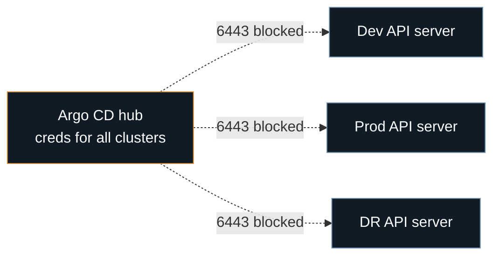
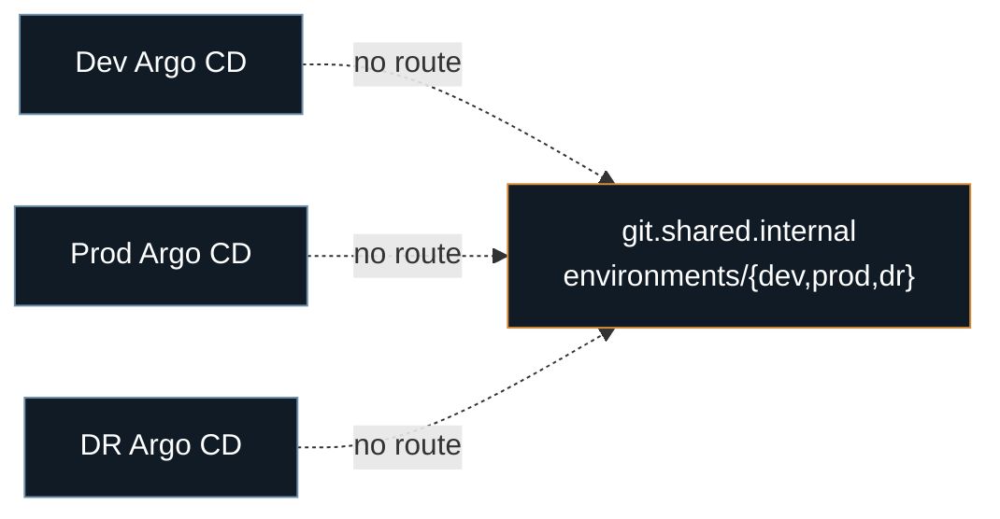
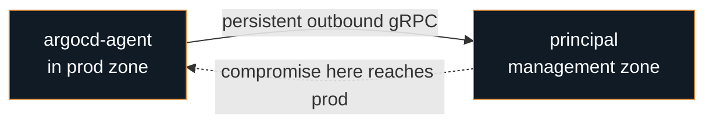
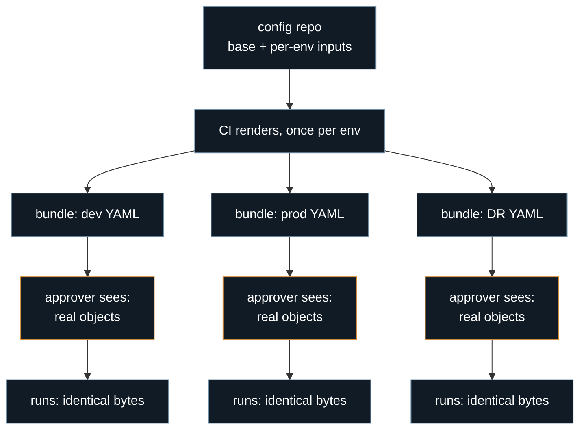
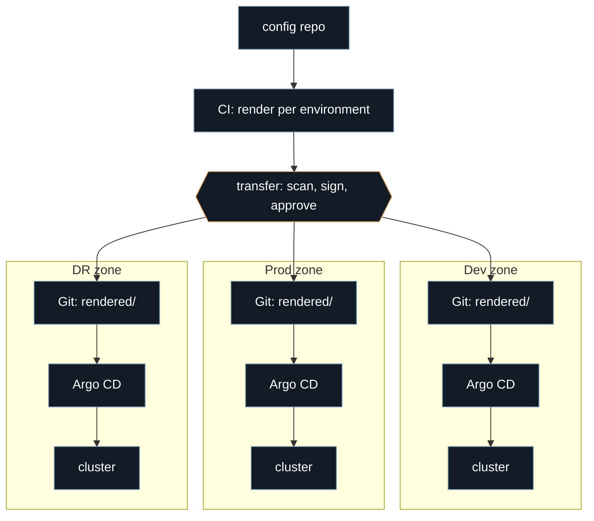
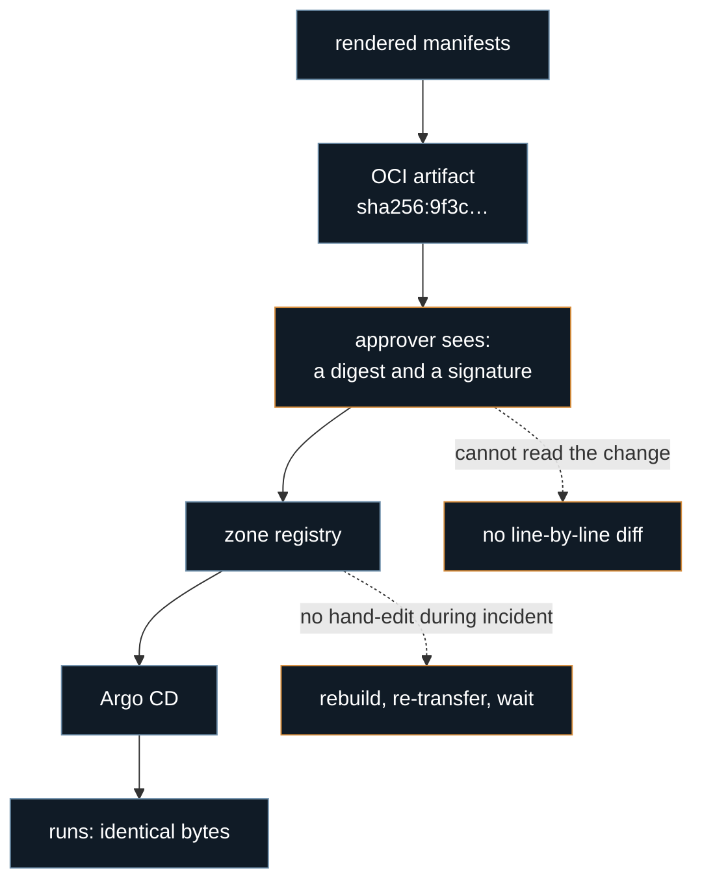

The Argo CD docs recommend several patterns for managing multiple clusters. A hub with credentials for every spoke. An app-of-apps tree from one config repo. An agent that dials out to a central principal. All three are well documented and all three work.

All three also assume connectivity in one form or another. Something reaches something else — inward, outward, or both.

In strictly isolated environments that assumption is gone. The zones are air-gapped; in some cases they are not reachable even from across a firewall, because a permitted firewall rule is still a live path and the whole point of the isolation is that no live path exists. Every documented pattern breaks, and it breaks on the same word.

This post walks each of the three, then two more approaches teams reach for once the first three are ruled out, then the one that actually survives strict isolation.

## The environment

Dev, prod and DR each sit in their own network zone. No route between them. Each zone has its own Kubernetes cluster, its own Argo CD, its own Git server, its own registry.

There is exactly one way through: **Deployment Bundle**. Someone builds a file on the connected side, a scanner checks it, an approver signs off, and it is copied into the target zone — over a data diode, on a disk, through a one-way relay, whatever your shop uses. One direction, one file, one human approval. I will call this **the transfer**, and it is the only thing in this post that moves anything between zones.

## What should be shared

| Layer | Share it? | What sharing costs you |
| --- | --- | --- |
| Network path between zones | No | One route is all lateral movement needs. Open it and the isolation stops existing, along with this post's premise. |
| Kubernetes clusters | No | One API server, one etcd, every environment. A bad RBAC binding is a prod incident and a DR incident at once. |
| Argo CD instances | No | A hub holds write credentials for every cluster it manages. Compromise it and you lose the fleet, not one environment. Also needs the network you just refused. |
| Delivery Git repos (what Argo CD syncs) | No — one per zone | Needs that same network path, and gives every zone a readable copy of every other zone's config. |
| Source repo + CI, before the transfer | **Yes. Only this.** | *Not* sharing it is the risk. No common ancestor means prod and DR are two products with one name, and "what differs" becomes a person reading YAML at 3am. |
| Images, Argo CD version | Transferred, not shared | A live shared registry is a network path. But skipping the transfer leaves three Argo CD versions drifting until one zone's CRDs stop matching. |

Rule: **share everything before the transfer, share nothing that needs a live path across it.**

Everything below follows from that line.

## Pattern 1: Hub-Spoke Model

The default recommendation. Cluster credentials live in Secrets in the Argo CD namespace ([Declarative Setup — Clusters](https://argo-cd.readthedocs.io/en/stable/operator-manual/declarative-setup/#clusters)), and the [ApplicationSet cluster generator](https://argo-cd.readthedocs.io/en/stable/operator-manual/applicationset/Generators-Cluster/) fans one Application out to all of them. One UI, one place to look.



**Problem.** Every arrow in that diagram is a dead one. The hub must reach each cluster's API server on 6443, and no such route exists. Building one is the exact thing the isolation forbids. This is not a poor fit, it is unavailable.

Worth noting the second problem even if you could build the route: that hub node holds write credentials for all three environments. It becomes the most valuable target in the estate.

## Pattern 2: app of apps from one config repo

A parent Application whose children are Applications ([Cluster Bootstrapping](https://argo-cd.readthedocs.io/en/stable/operator-manual/cluster-bootstrapping/)), with config in its own repo as [Best Practices](https://argo-cd.readthedocs.io/en/stable/user-guide/best_practices/) recommends. The usual layout has an `environments/` folder per zone.



**Problem.** The node on the right does not exist. Each zone runs its own Git server, so there is no repo that all three instances can clone. The pattern is not blocked by a firewall rule, it is missing its foundation.

The contents have to be physically copied in, which lands you back at the only real question: what goes in the bundle.

## Pattern 3: the agent, or pull, model

[argocd-agent](https://argocd-agent.readthedocs.io/) inverts the direction. Agents in the workload clusters connect out to a central principal, so the control plane never dials inward. The docs aim it squarely at teams for whom "control planes must maintain direct connections to every managed cluster" is the blocker — which, one paragraph ago, was us.



**Problem.** The solid arrow is the whole issue. It is a persistent connection from inside prod to a machine outside prod. Direction does not change that — the dotted arrow shows why, since anything that compromises the principal now has a standing channel into the zone.

This pattern genuinely solves egress-only topologies, and if a permitted outbound stream is acceptable in your environment, stop reading and use it. You are firewalled, not isolated, and firewalled is a much easier problem. If it is not acceptable, the agent is a hole in the isolation you are paying for.

That is the three documented patterns. All three fail on connectivity, which means the topology is now fixed: one Argo CD per environment, installed from transferred manifests, images from the zone registry, syncing from the zone's own Git. Nothing to decide there.

What is still open is what crosses in the transfer. That's the actual design question.

## The solution: render before the transfer

CI renders the manifests once per environment, from one source commit plus that environment's inputs. Plain, self-contained YAML goes in the bundle.



Nothing resolves in-zone, so there are no chart mirrors to maintain. The scanner reads actual Kubernetes objects, unconditionally — that benefit doesn't depend on how big the diff is. Argo CD does a plain directory sync with no repo-server templating at all. The zone's Git log becomes an exact record of what ran there, which is the audit artifact people usually want and rarely have.

"No template engine skew" needs one caveat: it holds for hand-written charts, not for the ecosystem. A chart that calls `lookup` to preserve a value or `rand`/`now` to generate one renders differently every time, because CI has no cluster to `lookup` against — it gets a fresh random value on every render, in every bundle, for every zone. Catch it in CI: render twice, diff the two outputs, fail the build if they differ. One extra render buys the determinism the rest of this post assumes.

Argo CD supports this natively now through the [source hydrator](https://argo-cd.readthedocs.io/en/stable/user-guide/source-hydrator/), beta since 3.5. The catch across an air gap isn't the direction, it's the source: the hydrator still needs a live pull from the dry source repo to render from, and that repo sits outside the zone, unreachable. CI-side rendering is the version that fits the constraint — it renders on the connected side, where the source repo is reachable, and carries the output across instead.

Full shape:



### Transport variant: ship OCI artifacts

Every zone already has a registry, so config can ride the same channel as images. Content addressing, digest pinning and cosign verification come free, and there is one transfer mechanism instead of two.



The main line is unchanged — what runs still equals what was approved, because rendering still happens before the transfer. Only the packaging moved. The two dotted branches are the price: the approver's column degrades to a digest, which proves the bytes did not change in flight but says nothing about *what* changed. And at 2am nobody edits a layer inside an OCI artifact; the fix is rebuild and transfer again, at transfer speed.

Take this if signing and immutability are hard requirements. Otherwise plain Git keeps the review readable.

## Difference without pretending

Usual advice: keep environments as similar as possible so staging tests prod. Sound advice, wrong situation. Zones isolated by network differ for real reasons — ingress, storage classes, backing services, scale.

The failure mode is over-DRYing. One base wide enough for all three, filled with conditionals, half of it overridden from a values file. The conditionals become the real source of truth and nobody can read them.

Better rule: the base holds only what is true in every zone, and anything that varies is an input, not a branch. A value that differs between prod and DR is a parameter. A component in prod but not DR is a composition decision in that environment's inputs, not an `if` in a template.

Before the transfer:

```
config/
  base/                    # true everywhere
    payments/
    checkout/
  environments/
    dev/values.yaml
    prod/values.yaml
    dr/values.yaml
```

CI renders `base` three times. What lands in a zone is flat and boring:

```
rendered/
  services/
    payments/
      deployment.yaml
      service.yaml
    checkout/
      ...
```

## Argo CD inside a zone

What makes three control planes feel like one system isn't that their config is identical — CA bundles, SSO, RBAC group mappings and controller sizing all differ per zone, same as anything else in this post that touches a real network. What *is* identical is the ApplicationSet, except for the repo URL. All variation lives in the rendered content, not in how Argo CD is wired.

One ApplicationSet with a Git directory generator does the wiring. Add a service directory, an Application appears. No ApplicationSet edit, no per-service manifest.

```yaml
apiVersion: argoproj.io/v1alpha1
kind: AppProject
metadata:
  name: services
  namespace: argocd
spec:
  sourceRepos:
    - https://git.prod.internal/platform/rendered.git
  destinations:
    - server: https://kubernetes.default.svc
      namespace: '*'
  clusterResourceWhitelist: []      # no cluster-scoped objects from this repo
  namespaceResourceWhitelist:
    - group: '*'
      kind: '*'
```

```yaml
apiVersion: argoproj.io/v1alpha1
kind: ApplicationSet
metadata:
  name: services
  namespace: argocd
spec:
  goTemplate: true
  goTemplateOptions: ["missingkey=error"]
  generators:
    - git:
        repoURL: https://git.prod.internal/platform/rendered.git
        revision: main
        directories:
          - path: services/*
  template:
    metadata:
      name: '{{.path.basename}}'
    spec:
      project: services
      source:
        repoURL: https://git.prod.internal/platform/rendered.git
        targetRevision: main
        path: '{{.path.path}}'
      destination:
        server: https://kubernetes.default.svc
        namespace: '{{.path.basename}}'
      syncPolicy:
        automated:
          prune: true
          selfHeal: true
        syncOptions:
          - CreateNamespace=true
  syncPolicy:
    applicationsSync: create-update       # never delete an Application, only add/update
    preserveResourcesOnDeletion: true     # and if one is deleted anyway, don't prune its objects
```

Three details worth defending.

The `AppProject` is the actual trust boundary in this topology, and it's easy to skip since Argo CD will run without one. `sourceRepos` pins the project to the one zone repo. `clusterResourceWhitelist: []` means a bundle that renders a `ClusterRoleBinding` gets rejected by Argo CD itself, not caught later by a human reading YAML. The credential-scoping argument below is worth nothing if anything that lands in the delivery repo can still touch the whole cluster.

The destination is always `kubernetes.default.svc`. Argo CD deploys into its own cluster and holds credentials for nowhere else — a real reduction in what a compromised control plane can do, and free with the topology. Compare that to the hub in pattern 1.

The ApplicationSet's own `syncPolicy` is what keeps that reduction from cutting the other way. Git directory generator plus `prune: true` normally means: a bad import that drops `services/auth/` from the tree deletes the Application, and deleting the Application prunes the Deployment. On a connected estate that's a `git revert` and a minute's wait. Here the instinct is to re-transfer, which is hours. `applicationsSync: create-update` takes deletion off the table — the ApplicationSet only ever creates or updates Applications, never removes one — so a malformed bundle degrades to "the new service didn't show up," not an outage on an existing one.

Prod runs auto-sync with self-heal, which is the part people argue about. Manual sync feels safer but puts the gate in the wrong place. A human clicking Sync is not a review, it is a rubber stamp with worse ergonomics than a pull request. The review already happened, on the rendered diff, before the transfer. Delaying application afterwards only widens the window where Git and the cluster disagree — the exact condition GitOps removes. Anything needing a timing gate rather than an approval gate belongs in a sync window, not a browser tab.

That argument is incomplete without rollback, and Argo CD refuses `argocd app rollback` on an app with automated sync enabled — so it has to be answered here, not waved at. The delivery repo already holds every prior state, so rollback is in-zone and doesn't touch the transfer at all: `git revert` the last import commit, push, and auto-sync reapplies the previous manifests on the next poll. No re-transfer, no approval cycle, minutes not hours. That path needs to be a named break-glass procedure with its own group and its own audit trail, not something anyone with a shell can do — and it only restores manifests, not images. A revert brings back the previous digest reference; if the zone registry already garbage-collected that image, the rollback fails at pull time. Registry retention is part of the rollback plan, not a housekeeping detail.

DR gets the same treatment: same source commit as prod, its own inputs, continuous sync. A DR cluster kept deliberately behind has an unknown recovery time. One that reconciles continuously has a known one, and its distance from prod is a diff you can read.

## What you give up

Bootstrap is not GitOps, and the post has been glossing over that with the phrase "installed from transferred manifests." Day one in a fresh zone, in order: Argo CD itself applied by hand with `kubectl apply -f`, because there is no Argo CD yet to sync anything; a Git server stood up and seeded with the delivery repo; a registry seeded with the base images; a secrets operator installed and pointed at that zone's own vault; the vault unsealed by a human holding a key share. None of that is declarative and none of it is optional — budget it as its own bundle and its own runbook, not a subclause.

Cross-zone automation stops working. Argo CD Image Updater cannot watch a registry it cannot reach; a Kargo warehouse cannot see a zone registry. Promotion either lives entirely before the transfer and drives it, or runs per zone against zone-local artifacts. Both work, neither is the default.

Version skew is now your problem. Three independent installs drift unless the Argo CD version moves through the same pipeline as everything else — pin it, transfer it, bundle it like any other service. "Audit" needs a real mechanism though, since the channel is one-way and nothing reports back: have the import script read the installed Argo CD version out of the zone cluster and refuse to push a bundle that was rendered against a different one. The only chokepoint that exists is the one that has to enforce it.

Diffs get large. Rendered YAML is verbose and a chart bump can change a thousand lines — at which point the human approver isn't reviewing anymore, just rubber-stamping under a transfer-window clock, the exact failure this whole pattern is meant to avoid. The scanner still benefits unconditionally; the human only benefits when the diff stays small. Make that true instead of assumed: fail the bundle in CI over some line-count budget unless someone explicitly labels it a bulk change, which forces version bumps and behavior changes into separate, reviewable transfers.

The pattern is not clever, deliberately. Render once, review the real thing, carry it across, let a plain credential-light controller apply it. When you cannot reach across to check on anything, boring and verifiable wins.
